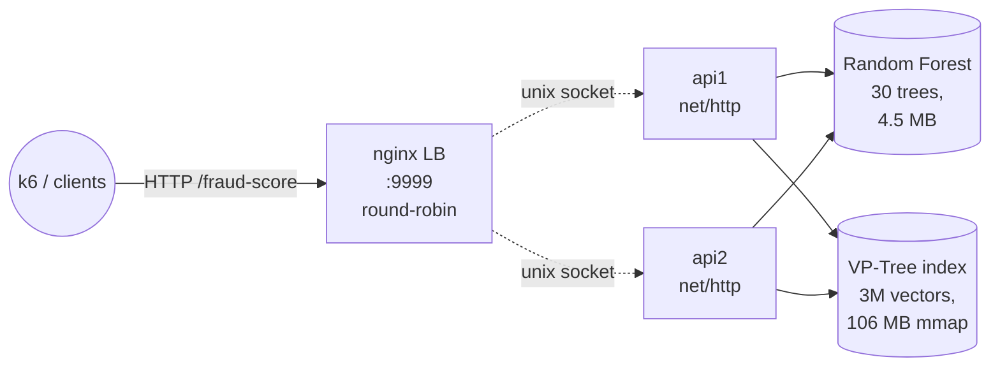

# Rinha de Backend 2026 — Fraud Scoring

A low-latency fraud-detection backend for the
[Rinha de Backend 2026](https://github.com/zanfranceschi/rinha-de-backend-2026)
challenge. Each request is a card transaction; the API must answer
`{approved, fraud_score}` based on similarity to a reference dataset of
3,000,000 labeled vectors.

The implementation combines:

- An **exact** VP-Tree k-NN index (the oracle the challenge scores against).
- A **distilled Random Forest** that handles the easy decisions in tens of
  nanoseconds.
- A **hybrid** path: when the forest is uncertain, fall back to the oracle.
- A net/http server with **Unix-socket** transport to the LB and
  **pre-computed JSON responses** to remove allocations from the hot path.



## Result

Local Docker Compose, 900 rps ramp, 120 s, k6 official dataset
(54,100 entries):

| Metric | Value |
| --- | --- |
| p99 | **1.05 ms** |
| score | **5,979** |
| false positives | **0** |
| false negatives | **0** |
| HTTP errors | **0** |
| failure rate | **0%** |
| resources | 2 × API: 0.42 CPU / 160 MB · LB: 0.16 CPU / 30 MB · total 1.0 CPU / 350 MB |

Detection is exact (the hybrid always reaches the same verdict the test oracle
expects). Latency is dominated by HTTP plumbing — k-NN itself runs in tens of
microseconds per query when the RF defers.

## Repository layout

```
cmd/
  api/          entrypoint
  preprocess/   builds the packed VP-Tree binary from references.json.gz
  distill/      builds distilled k-NN labels for training (parallel Go)
config/         env wiring
deploy/         nginx config
docs/           extended docs (architecture, performance, training)
internal/
  domain/       core entities and constants (14 dims, mcc_risk, thresholds)
  fraud/        Service.Score — orchestrates Vectorize → predict → hybrid
  dataset/      mmap loader for vectors.bin (VP-Tree-ordered)
  search/       exact kNN with VP-Tree pruning, k=5 and k=6 (distill)
  tree/         Go inference for sklearn DecisionTree / RandomForest binary
model/          Python training (uv): distill, fit DT/RF, export to Go binary,
                evaluate against test/test-data.json
pkg/
  dotenv/       env loader
  logger/       slog singleton
resources/      references.json.gz · vectors.bin · fraud_dt.bin · labels_distilled.bin
routes/         http.ServeMux router · fraud handler · health
test/           k6 scripts and the official test-data.json
```

See [docs/architecture.md](docs/architecture.md), [docs/performance.md](docs/performance.md), and
[docs/training.md](docs/training.md).

## Architecture decisions

### Vectorization (14 dimensions)
Implemented in [`internal/fraud/vectorize.go`](internal/fraud/vectorize.go),
following the formulas in
[REGRAS_DE_DETECCAO.md](https://github.com/zanfranceschi/rinha-de-backend-2026/blob/main/docs/br/REGRAS_DE_DETECCAO.md).
Quantized to int16 with scale 10,000. The `-1` sentinel for
`last_transaction == null` is preserved as `-Scale` (= -10,000) to keep the k-NN
geometry intact.

### VP-Tree (exact k-NN oracle)
- Rearranges 3M vectors in tree order at preprocess time.
- 14-dim Euclidean distance squared in int64.
- Recursive search with triangle-inequality pruning (`internal/search/knn.go`).
- 0 false positives, 0 false negatives against the official test set.

### Random Forest (fast classifier)
- 30 trees, max_depth 25, trained on the **distilled** labels (the k-NN
  majority over the reference set itself), so it learns to *mimic* the oracle
  rather than memorize raw labels.
- Exported to a packed binary (V2 format) consumed by `internal/tree/tree.go`.
- ~250 ns/query in Go, zero allocations on the hot path.

### Hybrid
1. RF computes a fraud score.
2. If the score is outside the uncertainty band `[0.2, 0.8]`, accept the RF
   verdict.
3. Otherwise call the VP-Tree oracle for an exact answer.

On `test-data.json` only 4.65 % of queries fall into the uncertain band; for
those the oracle is exact, so the **hybrid matches the oracle verdict on
100 %** of the test set.

### HTTP path
- Pure `net/http` with the Go 1.22 method-aware `ServeMux` (no framework on the
  hot path).
- LB → API over Unix sockets (`SOCKET_PATH` env), shared by a tmpfs volume.
- 6 pre-built JSON bodies (one per `k/5` oracle score) chosen by a tiny switch
  — no `json.Marshal`, no float formatting, no allocation.
- `sync.Pool` for the request struct.
- `sonic.Unmarshal` for the inbound payload.
- mmap-backed indexes, touched once at startup to warm the page cache.

## Running locally

Pre-requisites: Docker Desktop / Engine, [k6](https://k6.io/), and `uv` for the
Python tooling.

```bash
# 1) Generate the index and trained model (one-time)
go run ./cmd/preprocess                 # → resources/vectors.bin
go run ./cmd/distill                    # → resources/labels_distilled.bin
cd model
uv sync                                 # installs deps + Jupyter kernel
uv run python train.py --distilled --algo rf --n-estimators 30 \
    --max-depth 25 --min-samples-leaf 10
uv run python export_to_go.py           # → ../resources/fraud_dt.bin
cd ..

# 2) Bring the stack up
docker compose up -d --build
curl http://localhost:9999/ready

# 3) Run the k6 test
./run.sh                                # writes test/results.json
cat test/results.json | jq
```

The Jupyter notebook in `model/fraud-detection.ipynb` reproduces the same
pipeline interactively with EDA plots.

## Notes on the test environment

- The challenge runs on a Mac Mini Late 2014 under Ubuntu 24.04 (8 GB RAM).
- Per-container limits **must sum to 1.0 CPU and 350 MB** (`config.json`).
- The LB cannot inspect or transform the payload — round-robin only.
- Submissions must use bridge networking; no `host` or `privileged` modes.
