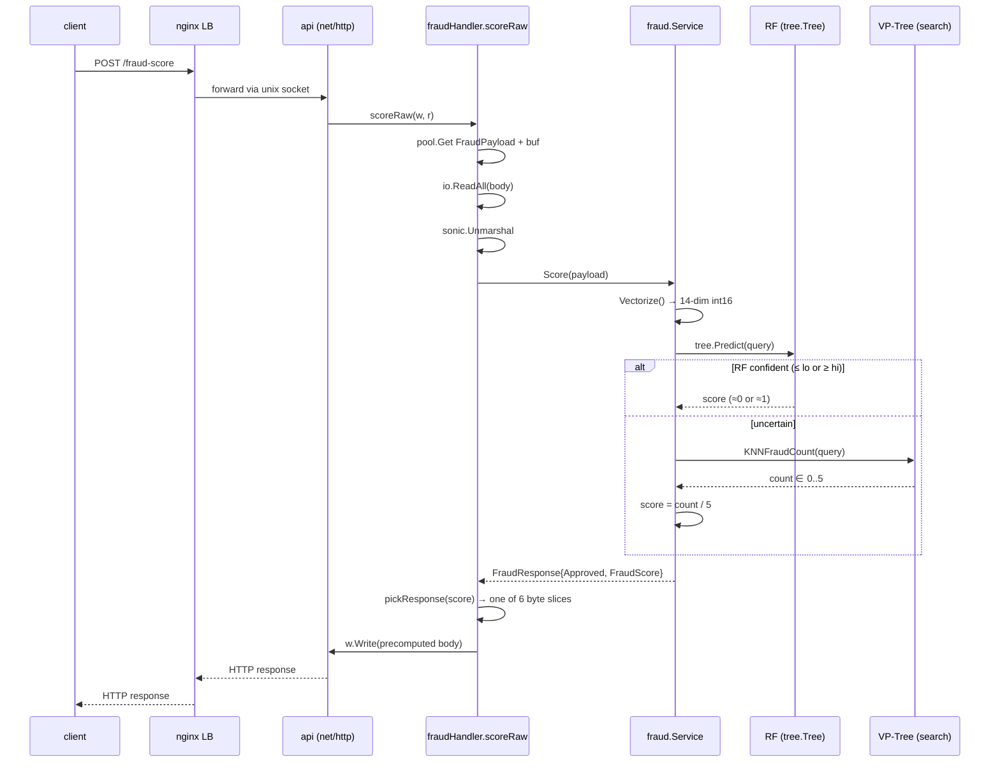
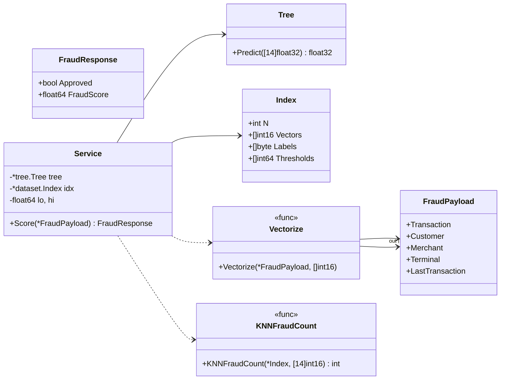
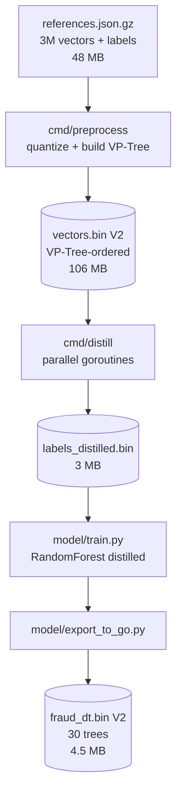
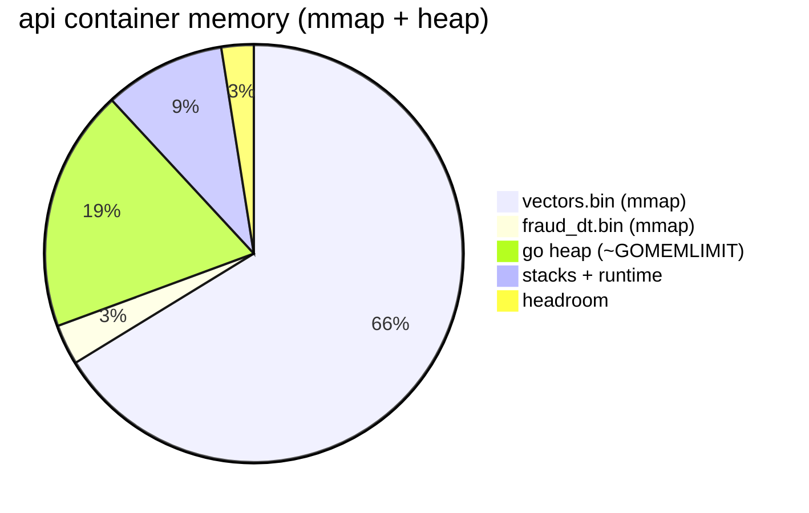

# Architecture

## Topology

```mermaid
flowchart LR
    client((k6 / clients))
    nginx[nginx LB<br/>:9999<br/>round-robin]
    api1[api1<br/>net/http]
    api2[api2<br/>net/http]
    sockets((tmpfs<br/>/sockets))
    data1[(vectors.bin<br/>fraud_dt.bin)]
    data2[(vectors.bin<br/>fraud_dt.bin)]

    client -->|TCP 9999| nginx
    nginx -. api1.sock .-> sockets
    nginx -. api2.sock .-> sockets
    sockets --> api1
    sockets --> api2
    api1 --> data1
    api2 --> data2
```

- **Two API instances** to satisfy the challenge requirement; both are
  identical and read the same packed indexes.
- **nginx** is the load balancer on `:9999` with round-robin upstream and
  Unix-socket transport to each API (no TCP between LB and APIs).
- A **tmpfs volume** is mounted into every container at `/sockets/`; that is
  where the APIs `bind()` their listening sockets and nginx connects.

## Request lifecycle



## In-process layout



## Data files



Both `vectors.bin` and `fraud_dt.bin` are **mmap'd** at startup and the page
cache is warmed by a touch-every-4K loop in [`internal/dataset/index.go`](../internal/dataset/index.go).
This keeps the Go heap small (≈ 20 MB) so the kernel can keep the file pages
resident under the 160 MB cgroup memory limit.

## Memory budget (per container)



Total ≈ 160 MB. `GOMEMLIMIT=30MiB` keeps the heap small; the rest is
reclaimable file cache.
