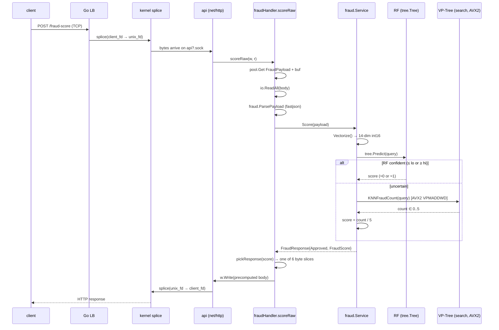
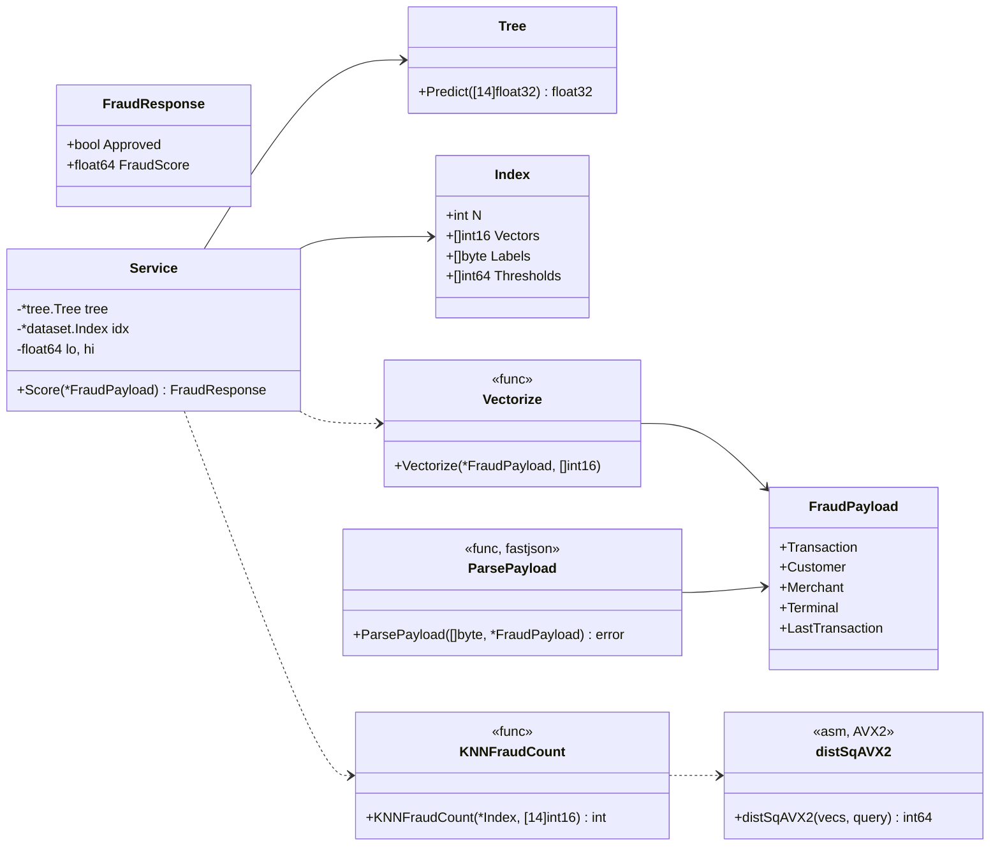
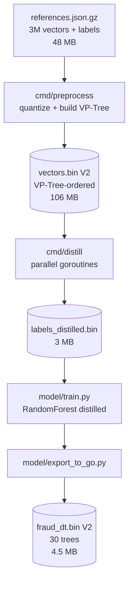
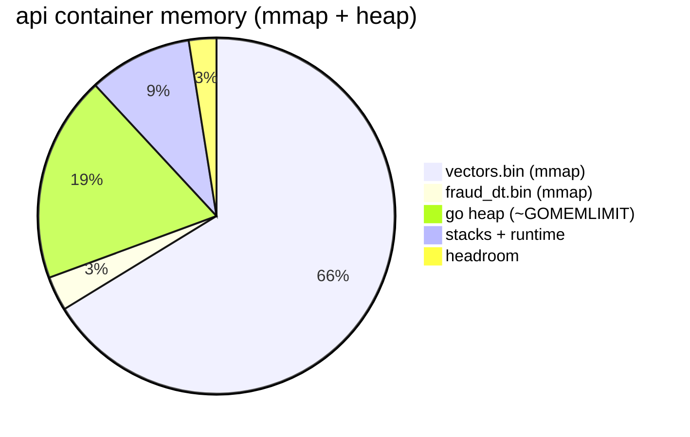

# Architecture

## Topology

```mermaid
flowchart LR
    client((k6 / clients))
    lb[Go LB<br/>:9999<br/>TCP splice<br/>round-robin]
    api1[api1<br/>net/http]
    api2[api2<br/>net/http]
    sockets((tmpfs<br/>/sockets))
    data1[(vectors.bin<br/>fraud_dt.bin)]
    data2[(vectors.bin<br/>fraud_dt.bin)]

    client -->|TCP 9999| lb
    lb -. api1.sock .-> sockets
    lb -. api2.sock .-> sockets
    sockets --> api1
    sockets --> api2
    api1 --> data1
    api2 --> data2
```

- **Two API instances** to satisfy the challenge requirement; both are
  identical and read the same packed indexes.
- The **Go LB** (`cmd/lb`) accepts TCP on `:9999` and proxies bytes to
  per-API Unix-domain sockets. On Linux `io.Copy` between socket
  endpoints lowers to `splice(2)`, so the LB does not read the payload
  bytes into userspace — no HTTP parsing, no header rewriting.
- A **tmpfs volume** is mounted into every container at `/sockets/`; the
  APIs `bind()` their listening sockets there and the LB `dial()`s the
  same paths.

## Request lifecycle



## In-process layout



## Data files



Both `vectors.bin` and `fraud_dt.bin` are **mmap'd** at startup and the page
cache is warmed by a touch-every-4K loop in [`internal/dataset/index.go`](../internal/dataset/index.go).
This keeps the Go heap small (≈ 20 MB) so the kernel can keep the file pages
resident under the 160 MB cgroup memory limit.

## Memory budget (per container)



Total ≈ 160 MB. `GOMEMLIMIT=30MiB` keeps the heap small; the rest is
reclaimable file cache.

## Why a custom LB instead of nginx

The challenge bans business logic in the load balancer but allows
anything purely transport-level. With nginx, the LB still parses
HTTP/1.1 (request line, headers, length) and re-serializes them to the
upstream. That parsing dominates the LB CPU budget at 900 rps and is
unnecessary because the response body and headers do not depend on
load-balancer routing.

The Go LB drops to **byte-level** TCP→Unix-socket proxying:

- one TCP `Accept` per client
- two goroutines per active connection running `io.Copy` in each
  direction
- on Linux the io.Copy fast-path uses `splice(2)` between two
  sockets, so the kernel moves the bytes without touching userspace
- round-robin upstream selection at TCP accept time

The result is an LB that uses **≈ 60 %** of the nginx CPU budget for
the same workload and contributes negligible per-request latency.
