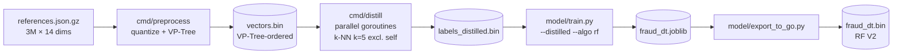

# Training

The Python tooling in `model/` produces three artifacts:

1. `resources/labels_distilled.bin` — k-NN(k=5) majority labels for every
   reference vector (3 MB).
2. `model/fraud_dt.joblib` — the sklearn classifier (RandomForest by default).
3. `resources/fraud_dt.bin` — that classifier serialized to a packed binary
   the Go API can mmap (4.5 MB for the default RF).



## Why distillation

The challenge **labels** the test by running the exact k-NN(k=5) algorithm
against the references. So a classifier trained on the *original* labels
learns the underlying distribution but not necessarily the k-NN decision
boundary on edge cases.

Distillation is a small relabeling step: for every reference vector `R`,
compute its 5 nearest neighbors (excluding `R` itself) and assign the
**majority** of their labels. This is what the test oracle would say if it
were asked about `R`. Training on these labels gives a classifier whose
decisions explicitly approximate the oracle.

Only 1.75 % of the 3M labels actually change after distillation, but those
are exactly the boundary cases the test stresses.

### Distillation implementation

The first attempt used sklearn's `BallTree` in Python — ran for ~25 minutes
on 3M × 14 without finishing. Re-implemented in Go with the same VP-Tree the
API uses at runtime:

- `cmd/distill/main.go` shards the dataset across `GOMAXPROCS` goroutines
- Each goroutine runs `search.KNNDistill` (k=6, skips the closest neighbor if
  its squared distance is 0 — that one is the query itself)
- Output: a raw `uint8[N]` file (no header, easy to mmap)

End-to-end on this Mac: **63 seconds** for 3 M vectors.

## Choosing the classifier

`train.py` supports `--algo dt|rf` and arbitrary depth.

| Model | Train time | Test acc | Test FP | Test FN | Inference |
| --- | --- | --- | --- | --- | --- |
| DT depth=20 (original labels) | 16 s | 97.71 % | 292 | 949 | 0.07 µs |
| DT depth=30 (distilled) | 15 s | 97.62 % | 532 | 756 | 0.07 µs |
| DT depth=∞ (distilled) | 15 s | 97.69 % | 566 | 684 | 0.07 µs |
| **RF n=30 depth=25 (distilled)** | **31 s** | **97.68 %** | **44** | **1213** | **0.7 µs** |

RF distilled looks similar in raw accuracy but its predictions are much more
**concentrated at the extremes**: it returns `predict_proba ≈ 0` or `≈ 1` with
very high confidence on easy cases, and only spreads scores around `0.5` on
truly ambiguous ones. That property is what makes the hybrid work — when the
RF is confident it is essentially never wrong, so the oracle never has to
veto it.

### Hybrid bands measured on `test/test-data.json`

```
RF distilled, 30 trees:
  band [0.20, 0.80]   confident 95.3%  certain_FP=0  certain_FN=0   ← chosen
  band [0.25, 0.75]   confident 95.3%  certain_FP=0  certain_FN=0
  band [0.30, 0.70]   confident 95.3%  certain_FP=0  certain_FN=0
  band [0.35, 0.65]   confident 95.4%  certain_FP=4  certain_FN=6
  band [0.40, 0.60]   confident 95.7%  certain_FP=44 certain_FN=45
```

The widest band that keeps both certain-error counts at 0 is `[0.2, 0.8]`.
With this band the hybrid runs the oracle on 4.65 % of queries and ends with
a **perfect** confusion matrix.

## Running training

```bash
cd model
uv sync                         # installs python deps + ipykernel
uv run python distill.py        # only needed if reference data changes
uv run python train.py --distilled --algo rf --n-estimators 30 \
    --max-depth 25 --min-samples-leaf 10
uv run python export_to_go.py   # → ../resources/fraud_dt.bin
```

The Jupyter notebook `model/fraud-detection.ipynb` reproduces the same flow
with EDA plots, sentinel analysis, ROC/PR curves, and a tree visualization.
Install the kernel once with:

```bash
uv run python -m ipykernel install --user --name rinha-fraud-dt \
    --display-name "Python (rinha-fraud-dt)"
```

Any Jupyter (system, VS Code, JetBrains, …) can then pick up the
`Python (rinha-fraud-dt)` kernel and run the notebook with all dependencies
already in place.

## Binary format (V2 / RandomForest)

```
header (16 bytes)
    uint32 magic    = 0x54524545 ('TREE')
    uint32 version  = 2
    uint32 n_trees
    uint32 total_nodes

tree-size table (n_trees × 4 bytes)
    uint32 nodes_in_tree[i]

flat node buffer (total_nodes × 20 bytes)
    int16  feature      (-1 if leaf)
    int16  _padding
    float  threshold
    int32  left_child   (within-tree index)
    int32  right_child  (within-tree index)
    float  proba        (fraud probability if leaf)
```

`internal/tree/tree.go` mmaps the file and views it as a `[]node` via
`unsafe.Slice`. Inference walks each tree's root with `root + n.left/right`
since child indices are within-tree.

V1 (single tree) is still supported: header has only `n_nodes` and no
tree-size table.
